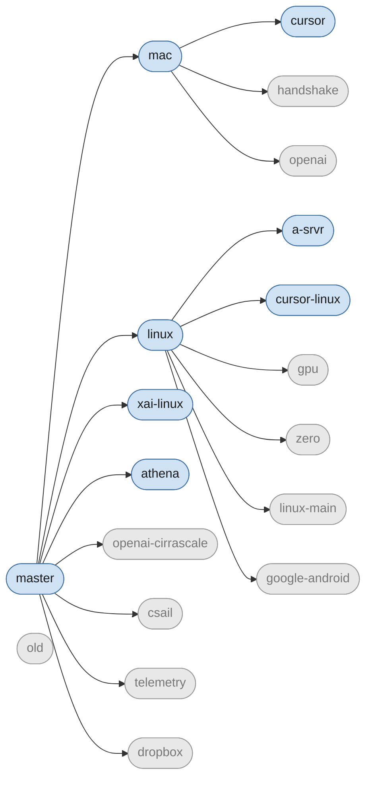

# Dotfiles (local) 

After cloning this repo, run `install` to automatically set up the development
environment. Note that the install script is idempotent - running it multiple
times has no effect.

Dotfiles uses [Dotbot][dotbot] for installation.

This repository contains machine-specific configuration to accompany my
[dotfiles][dotfiles]. The actual contents of this repository probably will not
be useful to anyone but me, but others may be interested in seeing how these
files are organized.

Configuration for specific computers (or groups of computers) is maintained in
separate branches in this repo.

Branch Hierarchy
----------------

License
-------

Copyright (c) Anish Athalye. Released under the MIT License. See
[LICENSE.md][license] for details.

[dotbot]: https://github.com/anishathalye/dotbot
[dotfiles]: https://github.com/anishathalye/dotfiles
[license]: LICENSE.md
